# ASCII Art & Image Processing

Image-processing workshop for **Visual Computing** at Universidad Nacional de Colombia (2020).
It converts images and videos into ASCII art and applies classic filters, both on the CPU (Processing / Java) and on the GPU (GLSL shaders).

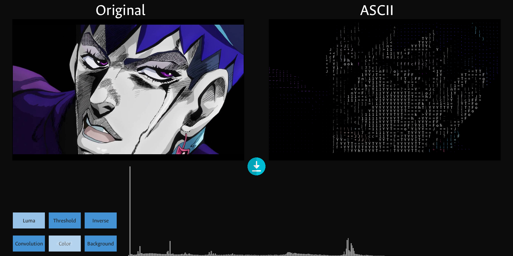

## Features

- **Filters:** grayscale (average and luma), color inversion, threshold, blur, edge detection
- **ASCII art:** characters are ranked by how many pixels they light up and mapped to the brightness of each image cell, with optional color and adjustable resolution
- **Brightness histogram** of the source image
- **Video:** the same pipeline applied live, frame by frame
- **GPU versions** of grayscale, convolution and ASCII as fragment shaders
- **Export** of the ASCII result to PNG

<b>Results</b>

| Original | Pure ASCII | ASCII + luma | ASCII + color |
|---|---|---|---|
| 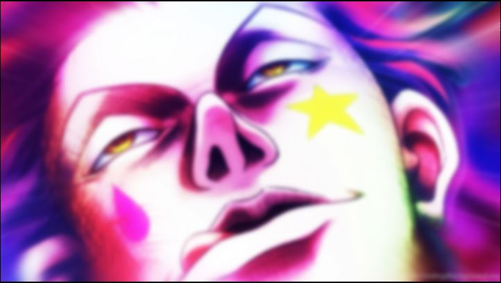 | 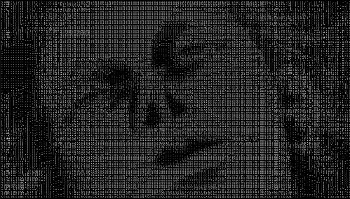 | 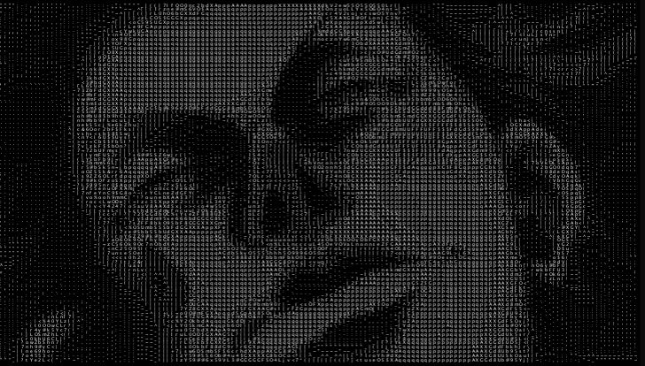 | 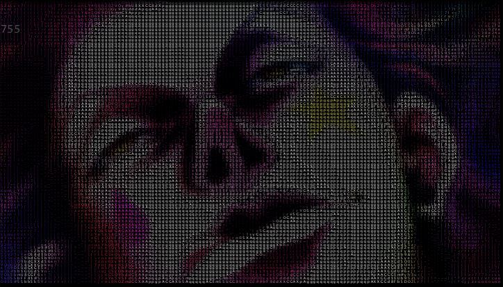 |

| Grayscale | Inversion | Edge detection | Blur |
|---|---|---|---|
| 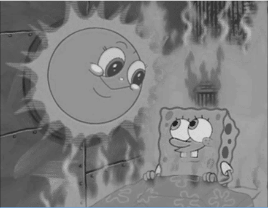 | 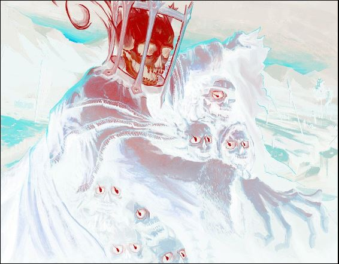 | 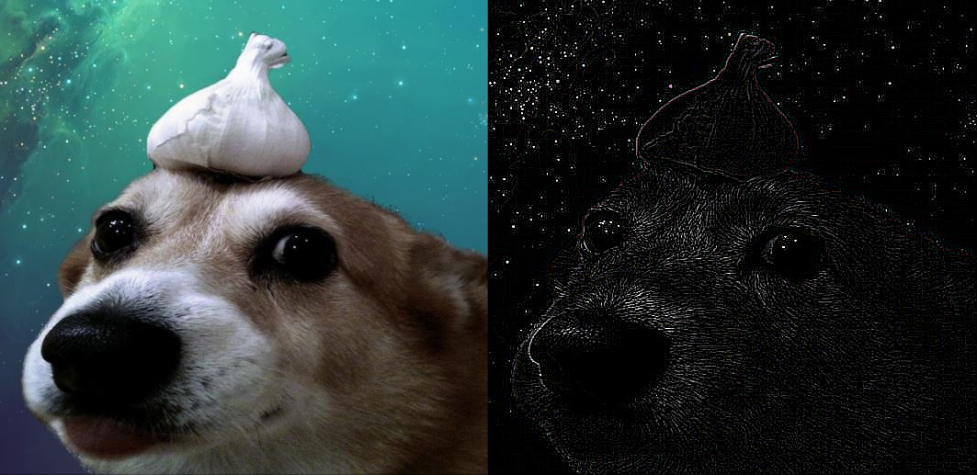 | 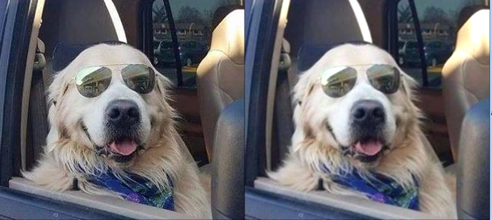 |

| Video (CPU) | ASCII shader (GPU) |
|---|---|
| 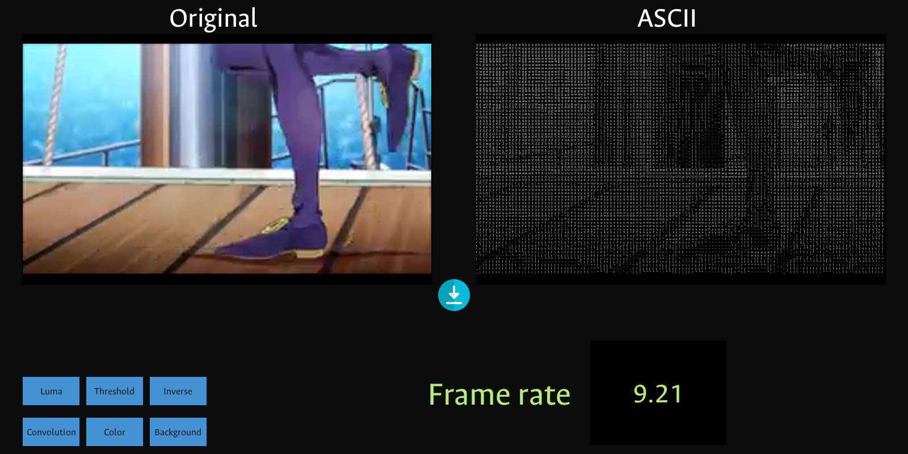 | 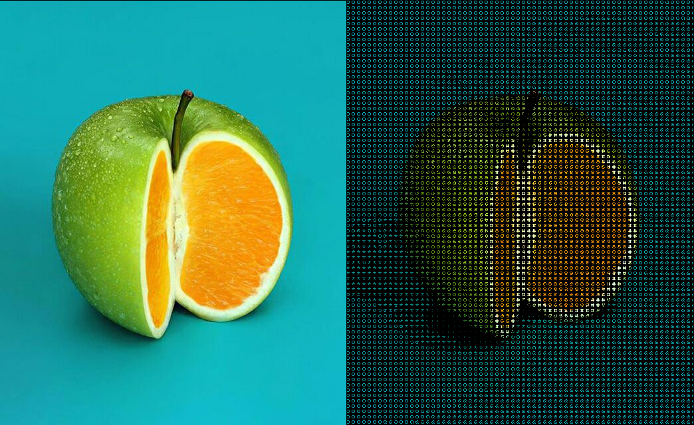 |

<b>How it works</b>

- **Grayscale:** either the plain RGB average, or luma `0.2126 R + 0.7152 G + 0.0722 B`.
- **Convolution:** a 3×3 kernel over every pixel, mirroring at the borders. A box kernel gives blur; a Laplacian (`8` centre, `-1` around) gives edges.
- **ASCII (CPU):** the 95 printable characters are each drawn once and ranked by lit-pixel count. The image is downscaled to N columns, and each cell is replaced by the character closest to its brightness.
- **ASCII (GPU):** based on movAX13h's *Bitmap to ASCII* shader. 8 brightness levels are mapped to 5×5 bitmap glyphs encoded as integers and drawn in 8 px cells.

<b>Project layout</b>

| Path | What it is |
|---|---|
| `ASCII_Image/sketches/ASCII_image` | Main image app (Processing sketch) |
| `ASCII_Image/sketches/ASCII_video` | Video app (Processing sketch + video library) |
| `ASCII_Image/src` | Same image app as plain Java (IntelliJ project) |
| `ASCII_Image_Shader/{BW,Convolution,ASCII}` | GPU versions (GLSL) |
| `ASCII_Image_Shader/ASCII2` | Unfinished glyph-atlas experiment |
| `ASCII_Image/video sketch` | Early draft of the video app |
| `ProyectoFinal/` | Early copy of the final project ([cv1-water_shader](https://github.com/anromerom/cv1-water_shader)) |

<b>Running it</b>

Tested in Oct 2026 with **Processing 4.5.7** and the **Video library 2.2.2** (Ubuntu 26.04, GStreamer 1.28).

1. Open a sketch folder in Processing, e.g. `ASCII_Image/sketches/ASCII_image`.
2. For video, install *Video Library for Processing 4* from the Contribution Manager.
3. Press Run.

| Input | Action |
|---|---|
| `↑` / `↓` | Cycle filters (original, luma, gray, invert, edges, blur) |
| `Space` | Next image / video |
| `p` | Play / pause (video) |
| Mouse wheel | ASCII resolution (10–200 columns) |
| Buttons | Luma, Threshold, Inverse, Convolution, Color, Background |
| ⬇ icon | Save the ASCII image to `ascii-output.png` |

<b>Known issues</b>

- **The video sketch shows black frames on Video library 2.x.** It calls `movie.read()` before `play()`, which worked on the 2020 library but now leaves the movie at 0×0. Remove that pre-play read to fix it.
- **The ASCII output is darker than it should be.** `nearest()` compares brightness (0–255) with raw lit-pixel counts (up to several hundred), so the densest characters are never chosen.
- **`Convfrag.glsl` uses the wrong weight for one neighbour** (`co1*col2` should be `co2*col2`). Symmetric kernels hide this.
- **Turning on Color and Background together gives colored text on white,** which is almost invisible.
- **The repo carries old Windows GStreamer DLLs and duplicated videos** (~260 MB).

## Team

| Member | GitHub |
|---|---|
| Nicolai Romero | [@anromerom](https://github.com/anromerom) |
| Julián Rodríguez | [@jdrodriguezrui](https://github.com/jdrodriguezrui) |
| Edder Hernández | [@Heldeg](https://github.com/Heldeg) |

MIT License.
